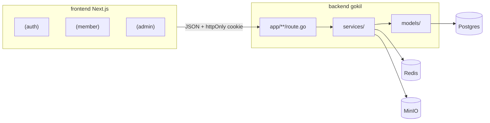

# DESIGN.md — MyOrganizations System

Dokumen ini menerjemahkan [`PRD.md`](PRD.md) menjadi keputusan arsitektur konkret: stack, pemisahan aplikasi, pemetaan entitas domain, batasan framework, model permission, background jobs, storage, dan roadmap pengembangan.

Panduan kerja AI agent: [`AGENTS.md`](AGENTS.md), [`CLAUDE.md`](CLAUDE.md).

## 0. Stack & Runtime

| Lapisan | Teknologi | Lokasi |
|---|---|---|
| API | Go 1.26 + **[gokil](https://github.com/lrndwy/gokil)** (`github.com/lrndwy/gokil`) | [`backend/`](backend/) |
| UI | Next.js 16 + React 19 + Tailwind v4 + **shadcn/ui** style `base-mira` (`@base-ui/react`) | [`frontend/`](frontend/) |
| DB | PostgreSQL 16 | Docker Compose `backend/docker-compose.yml` |
| Cache / session support | Redis 7 | sama |
| Object storage | MinIO (S3-compatible) | ditambahkan ke docker compose; provider gokil `s3` |

**Framework backend:** gokil adalah framework buatan sendiri (file-based routing ala Next.js + pola Django-like: settings, models, migrations, cron). Repo: <https://github.com/lrndwy/gokil.git>. Versi awal proyek: `v0.8.1`; setelah patch Fase 0 → bump ke `v0.9.0+` (lihat §0.1 dan §13).

**Desain UI:** seluruh tampilan memakai komponen shadcn yang sudah terpasang / ditambahkan lewat CLI. Preset `base-mira` + token CSS di [`frontend/app/globals.css`](frontend/app/globals.css) adalah **satu-satunya** sumber warna/radius (putih + aksen biru Permikomnas; palet divisi `--division-1..8`). Tidak menambah palette custom di luar token tersebut. **Tampilan selalu terang** — dark mode dihapus, field `theme` di settings tidak lagi dipakai UI.

Blok shadcn yang sudah di-install:
- `npx shadcn@latest add login-02` → `components/login-form.tsx`, `app/login`
- `npx shadcn@latest add signup-02` → `components/signup-form.tsx`, `app/signup`
- `npx shadcn@latest add sidebar-08` → `components/app-sidebar.tsx`, `nav-*`, `app/dashboard`

**Redis:** sudah tersedia di `docker-compose` dan `GOKIL_REDIS_*` di config, tapi **belum dipakai kode aplikasi** (tidak ada cache yang membaca/menulisnya). Untuk beban saat ini (data referensi ~2 ms, `/events` ~2 ms setelah perbaikan write-on-read) cache belum dibutuhkan; Redis baru masuk saat backend berjalan **lebih dari satu instance** (cache in-process jadi tidak konsisten) atau saat agregat berat mulai dipanggil sering. `GET /me` sudah menyertakan `permissions` supaya tidak ada request tambahan per load.

### 0.1 Batasan gokil v0.8.1 & Patch yang Diperlukan

Diverifikasi dari source `gokil@v0.8.1`. Agent **wajib** mengikuti aturan workaround sampai patch di-merge.

| Masalah | Dampak | Aturan / Patch |
|---|---|---|
| `models.Query/Create/Save/Delete` race (`gid()` selalu 0) | Concurrent request saling menimpa DB context | **Larang** `models.*` di handler. Pakai `orm.Objects[T](ctx.Request.Context())` / `orm.Create` / `orm.UpdateByID`. Patch: perbaiki `gid()` di upstream. |
| `orm.WithTx` tidak memasang `*Tx` ke context | Approval & counter surat tidak atomik | Sampai patched: transaksi kritis via `db.BeginTx` + raw SQL pada `*sql.Tx`. Patch: panggil `withTxContext`. |
| Tidak ada per-route middleware | Permission check mudah terlewat | Fungsi eksplisit `permission.Require(ctx, "code")` di awal setiap handler. Patch: `RegisterRoute` + middleware chain. |
| Tidak ada auth / RBAC / validation bawaan | Harus dibangun di project | Implement di `backend/internal/...` atau `backend/pkg/...`. |
| Tidak ada helper multipart | Upload file | `ctx.Request.FormFile` + `storage.Provider`. Patch: helper di `views.Context`. |
| Tidak ada `SELECT FOR UPDATE` / composite unique via ORM | Counter surat & unique attendance | Migration SQL manual + raw SQL `FOR UPDATE`. Patch opsional: `QuerySet.ForUpdate()`. |
| Envelope bawaan ≠ kontrak PRD | Frontend bingung | Wrapper response proyek (`success` / `message` / `data` / `errors`). Patch: samakan envelope di gokil. |
| `ctx.DB()` selalu nil | Jangan dipakai | Ambil DB dari `orm.DBFromContext(ctx.Request.Context())`. Patch: samakan context key. |
| Cron hanya `Every time.Duration` | Scheduler event status | Job interval 1 menit (cukup). Set `Logger` / `OnError` eksplisit. Tidak ada distributed lock — 1 proses cron. |
| Migration hanya deteksi ADD COLUMN; Postgres-only | Perubahan skema kompleks | Tulis SQL manual di `migrations/` bila perlu DROP/ALTER/INDEX. |
| Router linear; method mismatch → 404 | `/users/me` vs `/users/:id` | `generateroutes` mengurutkan route per path, jadi segmen statis yang secara alfabet jatuh setelah `:` **tertutup**: `GET /letters/export` (baris 142) selalu kalah oleh `GET /letters/:id` (baris 137) → 400 `invalid id`. Aturan: jangan menambah route statis 2-segmen di bawah resource yang punya `/:id`; gabungkan ke handler list (`GET /letters?export=csv`) atau naikkan jumlah segmennya. Dijaga otomatis oleh `app/register_test.go` (`TestRegisterHasNoShadowedRoute`) — jalankan test setelah `gokil generateroutes`. |
| Docs gokil menyebut API yang belum ada | Compile error jika diikuti | Percaya source & proyek ini, bukan `docs/views/*.md` gokil yang usang. |

**Prasyarat Fase 0** (repo terpisah `~/MyProjects/gokil`): fix `gid`, fix `WithTx`, per-route middleware, multipart helpers, `ctx.DB`, envelope `success/message/errors`, panic recovery + CORS + access log, opsional `ForUpdate`. Tag `v0.9.0`, bump `backend/go.mod`.

## 1. Arsitektur Aplikasi

Dua deployable yang berbagi kontrak API:

| Deployable | Pengguna | Fungsi utama |
|---|---|---|
| **`frontend/`** (Next.js) | Anggota + admin (satu app) | Auth UI, dashboard anggota, panel `/admin/*` |
| **`backend/`** (gokil API) | Frontend (+ klien lain) | Auth, business logic, storage, notifikasi, scheduler |

Di dalam frontend, pengalaman dipisah dengan **route groups** (bukan dua app terpisah):

| Group | URL | Shell |
|---|---|---|
| `(auth)` | `/login`, `/uhuyorangsenang` (halaman daftar, sengaja tidak dipublikasikan), `/recruitment/:slug` | Layout auth (blok login-02 / signup-02) |
| `(member)` | `/dashboard`, `/profile`, `/events`, … | Sidebar (sidebar-08) + menu anggota |
| `(admin)` | `/admin/...` | Sidebar yang sama; item menu difilter permission |

**Login terpusat:** UI auth hanya di `/login`. Akses ke `/admin/*` tanpa session mengalihkan ke `/login?next=/admin/...`.



### 1.1 Struktur direktori target

```
MyOrg-v2/
  PRD.md
  DESIGN.md
  AGENTS.md
  CLAUDE.md
  backend/
    app/                 # file-based routes → register.go (generated)
    cmd/backend/main.go
    models/
    services/            # business logic (bukan di handler)
    internal/            # auth, permission, response, storage wiring
    jobs/cron.go
    migrations/
    storage/             # local fallback path (prod pakai MinIO)
    docker-compose.yml   # postgres, redis, minio
    settings.go
  frontend/
    app/
      (auth)/login|uhuyorangsenang|recruitment/...
      (member)/dashboard|profile|events|...
      (admin)/admin/...
    components/          # shadcn ui + forms + app-sidebar
    lib/                 # api client, auth helpers, utils
    hooks/
```

**Layer backend:** `route.go` (bind/response + panggil service) → `services/` (logic) → `models/` + `orm` / raw SQL. Jangan taruh approval, counter surat, atau cron logic di handler.

### 1.2 Anggaran Performa & Animasi (frontend)

Aturan yang dijaga supaya aplikasi tetap ringan (diukur di build produksi, cold load):

| Aturan | Alasan / angka |
|---|---|
| Hanya font default (Inter) yang `preload`; 5 font pilihan tampilan memakai `preload: false` | Sebelumnya 6 font ikut di-preload = **192 KB** di critical path; sekarang 1 file (48 KB) dan font lain diambil saat benar-benar dipakai |
| Library berat **wajib** dynamic import: `jspdf`/`jspdf-autotable` (export PDF), `recharts` (grafik), `xlsx`, `docx-preview` | jspdf 131 KB hanya diambil saat klik Export; recharts menyusul setelah first paint (58 KB JS sebelum paint di dashboard admin) |
| Gambar di daftar/kartu pakai `loading="lazy"` + `decoding="async"` (hero tetap eager) | 13 lokasi; banner bawah fold tidak ikut di load awal |
| `GET /me` menyertakan `permissions` | Sidebar/AuthProvider cukup 1 request per load (dulu `/me` + `/me/permissions`) |
| Data awal dashboard (`/dashboard`) & daftar event (`/events`) diambil di **Server Component** (`lib/server-api.ts`, cookie user) lalu diteruskan ke komponen client | Kalender + kartu sudah ada di HTML pertama (35 sel hari terverifikasi di HTML), skeleton hilang di hard refresh: prod ~58 ms, dev ~128 ms sampai kalender terlihat |
| `GET /events` tidak lagi memindahkan status event (write di jalur baca dihapus; cron 1 menit yang menangani) | `/events` 60 ms → **~2 ms**; tidak ada lagi UPDATE saat ada yang membuka daftar event |
| Animasi masuk memakai CSS (`@keyframes fade-in-up` + `@utility animate-fade-in-up` di `globals.css`, helper `lib/motion.ts`) — **bukan** library animasi | Nol byte JS tambahan, hanya transform+opacity (GPU, tanpa layout shift), aman untuk LCP |
| Satu gerakan orkestrasi per halaman: daftar kartu `fadeInDelay(index)` (maks 8 langkah, 45 ms), konten halaman admin fade sekali | Menghindari efek tersebar (ciri slop) sekaligus tidak menunda konten terbaca |
| `prefers-reduced-motion` memaksa `animation-duration: 0.01ms` **dan** `animation-delay: 0ms` | Tidak ada jeda kosong/elemen transparan bagi pengguna yang mematikan animasi |

### 1.3 Aturan render & data (frontend)

Kelas bug yang sudah pernah terjadi — jangan diulang:

| Aturan | Kenapa |
|---|---|
| Server Component ambil data lewat **`serverGet`** (`lib/server-api.ts`, membaca cookie `token`), **bukan** `apiRequest` | `apiRequest` mengambil token dari `localStorage`/memori browser yang tidak ada di server → backend balas 401 → `notFound()` → halaman selalu 404 (pernah terjadi di `/admin/events/:id/edit`). |
| Jangan hitung **`getApiBase()` saat render** (termasuk di dalam `href`) | Nilainya beda di server (URL internal) dan browser (proxy same-origin). React **tidak menambal** atribut yang beda saat hidrasi → peringatan hydration + link menunjuk host internal di production (pernah terjadi di tombol Download Backup & Unduh surat). Untuk `href`, pakai path proxy relatif `/api/backend/...` — rewrite-nya aktif di semua mode dan unduhan same-origin tetap membawa cookie `token`. |
| Setiap halaman punya tepat satu `<h1>` | `PageHeader` menyediakannya sebagai `sr-only` karena judul visualnya berupa breadcrumb (`span`). Tanpa ini dokumen tak punya heading/landmark (WCAG 1.3.1). |
| `getRowId` tabel harus menunjuk field yang benar-benar ada | Baris rekap absensi tidak punya `id` (gabungan roster + absensi) → semuanya menjadi `"undefined"` dan React melempar peringatan duplicate key. Pakai `user_id`. |

## 2. Domain Model → Entity Mapping

Setiap tabel di PRD §4 dipetakan ke model Go yang embed `orm.BaseModel` (`ID int64`, `CreatedAt`, `UpdatedAt`). Urutan implementasi mengikuti dependency.

### 2.1 Division
| Field | Tipe | Catatan |
|---|---|---|
| `name` | string | |
| `description` | text | tugas pokok & fungsi |
| `color` | varchar(20) | nama token warna chip kalender (`division-1`..`division-8`); `""` = otomatis. Diatur di menu **Divisi** (`PUT /divisions/:id`), divalidasi allowlist di service supaya nilai DB tidak bisa menyuntik warna sembarang ke style |

### 2.2 Role & Permission (custom RBAC, lihat §5)
**Role:** `name` unique, `description` optional, `is_system` boolean (true untuk Admin bawaan).

**Permission:** `code` unique (e.g. `events.create`), `module`, `description` optional.

**RolePermission:** junction M2M `role_id` + `permission_id` — `UNIQUE(role_id, permission_id)` via migration manual.

### 2.3 User
| Field | Tipe | Catatan |
|---|---|---|
| `username` | string, unique | login identifier utama |
| `email` | string, unique | |
| `password_hash` | string | bcrypt |
| `full_name` | string | |
| `birth_date` | date, optional | |
| `hometown` | string, optional | |
| `phone` | string, optional | |
| `avatar_url` | string, optional | URL MinIO |
| `division_id` | FK → divisions | |
| `role_id` | FK → roles | |
| `status` | enum | `active` \| `inactive` \| `deleted` |

Auth login: **username** (utama) dan email (fallback).

### 2.4 OrganizationSettings
Singleton (max 1 row). Service menolak create kedua (409); delete dinonaktifkan.

| Field | Tipe |
|---|---|
| `web_name`, `logo_url`, `icon_url` | string |
| `theme` | `light` (kolom warisan; UI tidak lagi mengubahnya) |
| `allow_self_register`, `allow_cross_division_events_view` | boolean |

Admin UI: `/admin/settings` (form singleton), bukan CRUD list.

### 2.5 Event
`title`, `location`, `description`, `link_url` (link eksternal meeting/streaming), `division_id` nullable (**divisi penyelenggara**, null = tidak ditentukan), `banner_url`, `start_time`, `end_time`, `allow_permission`, `audience` (`all` \| `custom`), `status` (`upcoming` \| `ongoing` \| `finished` \| `cancelled`), `created_by`.

**`end_time` opsional.** Form tidak mewajibkannya; dikosongkan berarti event berakhir di penghujung hari `start_time` (`endOfDay`, 23:59:59 di zona waktu `start_time`). Kolom tetap `NOT NULL` — tidak ada migration.

- UI yang mengisi default itu di **zona browser** (`lib/datetime.ts` → `endOfDayInput`), karena hanya browser yang tahu tz user; backend tidak menebak.
- Backend tetap punya fallback yang sama untuk klien non-browser: `end_time` kosong ⇒ `endOfDay(start_time)` di zona `start_time`. Jadi kirim `start_time` ber-zona (`+07:00`) kalau memakai API langsung.

**Cakupan event** — siapa saja yang jadi peserta. Dua tabel target (pola `RecruitmentTargetDivision`):

| Tabel | Isi |
|---|---|
| `event_target_division` | divisi peserta, `UNIQUE(event_id, division_id)` |
| `event_target_role` | role peserta, `UNIQUE(event_id, role_id)` |

Dua sumbu terpisah yang **saling menambah (OR)**, bukan memfilter: peserta = anggota divisi target ∪ pemegang role target. Contoh: PH membuat "Rapat Koor" untuk divisi PH + PSDM **dan** role PH → seluruh anggota PH, seluruh anggota PSDM, plus semua pemegang role PH lintas divisi.

- `audience = 'all'` → seluruh anggota aktif, baris target diabaikan (tombol "Semua Divisi" di form).
- `audience = 'custom'` → **wajib** minimal satu divisi atau role (`validateAudience`). Event tanpa peserta ditolak.
- `division_id` **bukan** cakupan — itu penyelenggara, dan tidak berarti anggota divisi itu ikut hadir.

`services/event_audience.go` adalah satu-satunya penentu peserta (`EventAudience`, `eventIncludesUser`, `IsEventParticipant`), dipakai bersama oleh filter daftar, guard absen, guard izin, dan rekap — supaya keempatnya tidak pernah berbeda pendapat. Resolusi bekerja di memori dari satu query user (`activeUsers`) karena gokil salah menomori placeholder saat `Filter("__in")` digabung filter lain.

`GET /events/:id/targets` mengembalikan roster + jumlahnya; `GET /event_audience` mengembalikan divisi/role beserta jumlah anggota untuk form (path tanpa `:id` karena router gokil linear — `/events/cakupan` akan tertangkap `/events/:id`).

**Batas edit/hapus** (`CanManageEvent`): event sendiri, anggota divisi penyelenggara, atau `events.view_all`. **Recap** disusun dari roster, bukan tabel `attendances` — sehingga "Tidak Hadir" benar-benar terhitung; absensi di luar roster tetap ikut tampil agar tidak ada data tersembunyi.

### 2.6 Attendance
`event_id`, `user_id`, `status` (`present` \| `permitted` \| `absent` \| `rejected`), `selfie_url`, `signature_url`, `checked_in_at`.  
**UNIQUE `(event_id, user_id)`** — migration SQL manual (ORM tidak generate composite unique).

### 2.7 PermissionRequest (Perizinan)
`event_id`, `user_id`, `category_id` (FK `permission_category`), `reason` (opsional), `proof_url`, `status`, `reviewed_by`, `review_note`, `reviewed_at`.

**PermissionCategory** (master data): `name`, `description` — dikelola di `/admin/permissions/categories` (`permission.categories.manage`). Kategori yang masih dipakai tidak bisa dihapus (`PermissionCategoryService.Delete`).

**Aturan pengajuan** (`PermissionRequestService.Create`, semua ditegakkan di server):
- Event harus `allow_permission`, belum `finished`/`cancelled`, dan pengaju peserta event.
- **Batas waktu `PermissionLeadTime` = 3 jam sebelum `start_time`** (`PermissionClosed`) — setelah itu (termasuk saat event berjalan) ditolak.
- Kategori harus ada; keterangan opsional; **bukti gambar wajib**.
- Bukti dinormalkan `internal/imageutil`: sniff MIME (JPG/PNG/WebP/GIF saja, HEIC/PDF ditolak), batas 8 MB & 40 MP, sisi terpanjang dipotong ke 1600 px, lalu di-encode **WebP lossy** (library `gen2brain/webp`, libwebp via WASM — tanpa cgo) → yang tersimpan di storage selalu `image/webp`.

### 2.7.1 PermissionCategory (Master Data Kategori Izin)
`name` (wajib), `description`. Seed awal: **Sakit** dan **Izin**.

### 2.8 Violation
`user_id`, `issued_by`, `violation_type`, `sp_level`, `description`, `document_url`, `issued_date`.

`GET /violations/me` (cukup auth): user melihat pelanggaran & SP miliknya sendiri — halaman panel anggota `/my-violations` + alert SP di dashboard anggota. `violations.view` tetap untuk melihat data orang lain.

### 2.9 Recruitment
**Recruitment:** `title`, `description`, `slug` unique, `open_date`, `close_date`, `status`.

**RecruitmentTargetDivision**, **RecruitmentCustomField** (`field_options` sebagai `json.RawMessage` + tag `orm:"type:json"`), **RecruitmentSubmission** (`custom_answers` JSON; `nim` legacy).

### 2.10 Letter
**LetterCategory:** `name`, `code`, `start_number`, `current_number`, `number_format_template`.

**LetterTemplate / Letter:** sesuai PRD; outgoing merge `.docx`; incoming upload + parse/OCR.

Placeholder: `{NOMOR_SURAT}`, `{NAMA_ORGANISASI}`, … Alias legacy `{NOMOR}` / `{LETTER_CODE}`.

### 2.11 Announcement
`title`, `content`, `target_type`, `target_division_id`, `publish_date` + attachments inline di form.

### 2.12 Keuangan (Bendahara)
**FinanceCategory**, **FinanceTransaction** — permission `finance.*`. Endpoint summary/dashboard kustom.

**Wallet** (sumber dana: kas tunai, rekening bank, e-wallet):

| Field | Tipe | Catatan |
|---|---|---|
| `name` | string | wajib |
| `description` | text | opsional |
| `initial_balance` | float | saldo awal |
| `is_active` | boolean | wallet nonaktif disembunyikan dari form transaksi |

`FinanceTransaction.wallet_id` nullable FK → wallets (`ON DELETE SET NULL`). Saldo wallet = `initial_balance` + pemasukan − pengeluaran (dihitung service, bukan kolom). Endpoint: `GET/POST /wallets`, `PUT/DELETE /wallets/:id`; saldo per wallet ikut di `GET /finance_transactions/dashboard`. Permission: `finance.view` (lihat), `finance.wallets.manage` (kelola). Wallet dengan transaksi tidak bisa dihapus.

### 2.13 Catatan ORM
- Relasi: `orm.BelongsTo`, `orm.HasMany`, `orm.ManyMany` (FK `int64`).
- **Kolom nullable wajib pointer.** Kolom FK yang `ON DELETE SET NULL` (`created_by_id` di Event/Letter/Announcement/Recruitment/FinanceTransaction/StorageFile, `violation.user_id`+`issued_by_id`, `activity_log.user_id`) harus bertipe `*int64` di model. Kalau `int64`, satu baris NULL membuat **seluruh** SELECT gagal (`converting NULL to int64 is unsupported`) dan endpoint balas 500 untuk semua orang — bukan hanya melewati baris itu. Pemakaian cocokkan lewat helper `ownedBy(creator, userID)`, jangan `== user.ID` langsung.
- Field JSON: `models.JSONField` (`type:json;null`) — maps NULL → `{}` saat scan. Jangan `json.RawMessage` telanjang pada kolom nullable: `json.RawMessage` **tidak** bisa men-scan NULL dan mematikan endpoint list-nya.
- Tambahkan `json` tags pada model/DTO agar API tidak mengekspos `Author.Ref` / PascalCase mentah bila diperlukan.
- Hindari `models.Save` pada instance baru (bisa jadi UPDATE `WHERE id = 0`); pakai `orm.Create`.

## 3. Endpoint Publik (di luar auth)

| Endpoint | Auth | Catatan |
|---|---|---|
| `GET /settings` | Public | Subset branding: `web_name`, `logo_url`, `icon_url`, `theme` |
| `GET /public/recruitment/:slug` | Public | Form recruitment |
| `POST /public/recruitment/:slug/submit` | Public | Submission tanpa login |

## 3.1 Catatan path API vs PRD

Package Go tidak mendukung hyphen di nama folder. Beberapa endpoint memakai **underscore**:

| PRD (hyphen) | Implementasi |
|---|---|
| `/permission-requests` | `/permission_requests` |
| `/attendance/permission-requests` | `/attendance/permission_requests` |
| `/letter-categories` | `/letter_categories` |
| `/finance-transactions` (jika ada) | `/finance_transactions` |

Frontend harus memanggil path underscore.

## 4. Endpoint Kustom (di luar CRUD standar)

| Endpoint | Auth | Catatan |
|---|---|---|
| `PUT /settings` | `settings.manage` | Multipart logo/icon |
| `GET /me`, `PUT /me`, `PUT /me/password` | Auth | Profile |
| `GET /me/permissions` | Auth | Daftar permission code untuk gating sidebar |
| `GET /events/:id/recap` | `events.view` | Aggregasi + export |
| `POST /events/:id/attendance` | `attendance.submit` | Selfie + signature |
| `GET/PUT /attendance/permission-requests/*` | `attendance.approve` (semua event) \| `attendance.approve_own` (hanya event yang dikelola) | Approval, lihat §6.2 |
| `DELETE /attendance/permission-requests/:id` | `attendance.approve` | Hapus pengajuan |
| `POST /permission-requests`, `GET /permission-requests/me` | `permission.submit` | Ajukan & riwayat |
| `GET /users/import/template`, `POST /users/import` | `users.import` | Bulk import |
| `GET /roles/:id/permissions`, `PUT /roles/:id/permissions` | `roles.edit` | Matrix replace-all |
| `POST /letters/parse-incoming` | `letters.manage` | Preview parse |
| `GET /letter_templates/:id/variables` | `letters.manage` | Placeholder `.docx` + metadata format nomor |
| `POST /letter_categories/:id/preview-number` | `letters.view` | Preview nomor surat dengan segmen dinamis |
| `GET /backup`, `POST /backup` | `backup.manage` | Export ZIP / restore replace (lihat §6.10) |
| `GET/POST/DELETE /push/subscribe` | Auth | Web Push |

## 5. Model Role & Permission (Custom RBAC)

| Layer | Fungsi |
|---|---|
| **System admin** (`roles.is_system` / flag setara) | Gate panel admin tooling (backup, maintenance) |
| **Custom Role + Permission** | Gate fitur bisnis: `events.create`, dll. |

**Check di handler** (sampai per-route middleware gokil siap):

```
function RequirePermission(ctx, code):
  user = currentUserFromJWT(ctx)
  if not userHasPermission(user.role_id, code) and not isSystemAdmin(user):
    return 403
```

Permission awal: `settings.manage`, `users.view/create/edit/delete/import`, `roles.view/create/edit/delete`, `events.view/create/edit/delete`, `attendance.submit/approve/approve_own`, `divisions.view/create/edit/delete`, `permission.submit`, `permission.categories.manage`, `violations.view/manage`, `recruitment.manage`, `letters.view/manage`, `announcement.create`, `finance.view/create/edit/delete/categories/manage`, `finance.wallets.manage`, `storage.view/upload/delete/manage`.

**Approval izin dua tingkat:** `attendance.approve` = semua event (Admin, PH); `attendance.approve_own` = hanya event yang dikelola (pembuat atau divisi penyelenggara). Seed menyebarkannya otomatis: pemegang `events.create` (PH/Kadiv/Sekdiv/KOORDA) mendapat `approve_own`, pemegang `attendance.approve` mendapat `permission.categories.manage`.

Role **Bendahara** seed: semua `finance.*`.

**Admin UI gating:** sidebar filter dari `GET /me/permissions`. System admin bypass permission bisnis.

**Data referensi untuk dropdown form** (`permission.UserHasAny`): endpoint list read-only yang menjadi sumber dropdown boleh diakses pemegang salah satu permission terkait, bukan hanya permission modulnya — supaya role scoped (mis. KADIV dengan `events.*` saja) tetap bisa mengisi form:
- `GET /divisions` → cukup login (data non-sensitif: nama+deskripsi; dipakai panel anggota, form event, form user).
- `GET /roles` → `roles.view` | `users.view/create/edit`.
- `GET /users` → `users.view` | `violations.manage`.
- `GET /letter_categories` → `letters.view` | `letters.manage`.
- `GET /violation_types` → `violations.view` | `violations.manage`.
- `GET /finance_categories`, `GET /wallets` → `finance.view` | `finance.create` | `finance.edit`.

Operasi tulis (POST/PUT/DELETE) tetap memakai permission spesifik modulnya.

## 6. Business Logic Kunci (Service Layer)

Semua logic non-trivial di **`services/`**, bukan di `route.go`.

### 6.1 Event Status Transition
Cron job tiap 1 menit (`jobs/cron.go`):
- `upcoming → ongoing` saat `now >= start_time`
- `ongoing → finished` saat `now >= end_time`

Cron ini **satu-satunya** yang memindahkan status massal: `ListVisible` sengaja tidak lagi memanggil `TransitionStatuses` (dulu tiap GET menulis UPDATE). `GET /events/:id` masih menyinkronkan satu event agar detail selalu akurat.

Event tanpa `end_time` memakai `endOfDay(start_time)` (23:59:59 di zona `start_time`) untuk perhitungan status, absensi, dan izin — jadi tidak ada event yang menggantung tanpa batas waktu.

Jalankan sebagai proses terpisah: `go run ./cmd/backend cron`. Set `Logger`/`OnError`. Satu instance saja (tidak ada distributed lock).

### 6.2 Absensi & Perizinan
- Absensi hanya jika `event.status == 'ongoing'`.
- Upload selfie & signature ke MinIO; simpan **URL** di DB.
- Approval: update `permission_requests` + `attendances` dalam **satu transaksi** (`*sql.Tx` + raw SQL sampai `WithTx` di-patch).
- **Batas waktu izin:** pengajuan ditutup 3 jam sebelum event mulai (`PermissionLeadTime`; frontend memakai aturan sama di `lib/permission-deadline.ts` untuk menonaktifkan tombol + menjelaskan batasnya). Duplikat pengajuan yang ditolak boleh diajukan ulang, tapi tetap tunduk batas waktu ini.
- **Bukti izin wajib gambar** dan dikonversi ke WebP di server (`internal/imageutil`), jadi storage tidak menampung JPEG/PNG mentah ukuran besar.
- **Satu kali per event:** absen ditolak jika sudah ada attendance ATAU pengajuan izin pending/approved; pengajuan izin ditolak jika sudah tercatat hadir/izin ATAU ada pengajuan pending/approved (izin yang ditolak boleh diajukan ulang). Guard di `AttendanceService.Submit` & `PermissionRequestService.Create`.
- `GET /attendance/permission_requests` (admin) mengembalikan **semua status** + ringkasan `user`/`event` (`ListAllDetailed`); `GET /permission_requests/me` menyertakan ringkasan `event` (`ListMineDetailed`). `DELETE /attendance/permission_requests/:id` (gate `attendance.approve`) menghapus pengajuan; attendance turunan review (permitted/rejected) ikut dihapus dalam satu transaksi — attendance hasil check-in (`present`) tidak disentuh.
- **Cakupan approval izin:** `attendance.approve` = semua pengajuan; `attendance.approve_own` = hanya pengajuan dari event yang user kelola (`CanManageEvent`: pembuat, divisi penyelenggara, sistem admin). Penegakannya di `PermissionRequestService.CanReview`, dipakai oleh daftar (`ListReviewable`, satu query event lalu filter di memori) maupun aksi `Review` — jadi daftar dan tombol Setujui/Tolak tidak pernah berbeda pendapat. Menu "Approval Perizinan" tampil untuk salah satu dari kedua permission itu; tombol Hapus pengajuan tetap khusus approver global.
- Form buat event di admin default `allow_permission = true`; matikan per event bila izin tidak berlaku.
- Profil (`PUT /me`): field `email` bisa diubah pemilik akun — divalidasi format + unik (case-insensitive, disimpan lowercase).

### 6.3 Generate Kode Surat & Dokumen Outgoing
1. Ambil template + kategori.
2. `BEGIN`; `SELECT ... FOR UPDATE` pada kategori; hitung nomor dari `current_number` / `start_number`.
3. Render `number_format_template` → `letter_code`:
   - **Placeholder sistem (auto):** `{number}` (default 3 digit: 001, 002, …), `{number:N}` (zero-pad eksplisit), `{code}`, `{month_roman}`, `{year}`, alias `{nomor}`, `{letter_code}`. Gunakan `{number:0}` untuk nomor tanpa zero-pad.
   - **Placeholder custom (input per surat):** segmen dinamis seperti `{unit}`, `{tujuan}` — wajib diisi di form surat keluar; nilai disimpan di `variable_values`.
   - **Teks literal** di template (mis. `Permikomnas Jawa Tengah`) tetap statis per kategori.
   - Contoh kategori `SPm-i` + template `{number:3}/{code}/{unit}/Permikomnas Jawa Tengah/{month_roman}/{year}` → `001/SPm-i/PAN-Stuband/Permikomnas Jawa Tengah/VII/2026`.
   - Override manual `letter_code` diizinkan; counter tetap increment.
4. Simpan letter + `variable_values` (JSON) — dipakai untuk nomor dan merge `.docx`.
5. Merge `.docx` → upload MinIO → `document_url`.
6. Preview nomor: `POST /letter_categories/:id/preview-number` body `{ segments: { "unit": "..." } }`.
7. Incoming: upload saja (tanpa merge); kategori internal `SM-IN` bila berlaku.

### 6.4 Role Permission Matrix
`GET` → semua permission + `assigned_ids`.  
`PUT` body `{permission_ids: []}` → replace-all dalam transaksi.

### 6.5 Notifikasi
Job async (nanti Redis/queue jika perlu): email kredensial import, hasil approval izin, announcement + Web Push.  
Model `PushSubscription`: `user_id`, `endpoint` unique, `p256dh`, `auth`.

### 6.6 Visibility Divisi
```
if user lacks "events.view_all" AND settings.allow_cross_division_events_view == false:
  filter events where division_id = user.division_id OR division_id IS NULL
```

### 6.7 Organization Settings Singleton
Service enforce max 1 row.

**Kustomisasi tampilan** (kolom `appearance`, TEXT berisi JSON): parameter `style` (preset vega/nova/mala/lyra/mira/luma/sera/rhea — kurasi sendiri, bukan token registry premium shadcn), `base` (neutral/stone/zinc/gray/slate), `primary` (12 warna, bawaan `permi` = biru dari logo), `chart` (5 palet), `heading_font`/`text_font` (6 font Google via next/font, variabel `--font-*` di root layout), `radius` (rem). Frontend `lib/appearance.ts` menerjemahkan config → CSS variables `:root` yang di-inject sebagai `<style id="app-appearance">` (menimpa default base-mira di `globals.css`); `AppearanceSync` menerapkannya saat load, panel di `/admin/settings` menerapkan draft secara live sebelum disimpan lewat `PUT /settings` (field form `json`). `appearance` kosong/invalid → fallback tampilan bawaan.

### 6.8 User Import
Parse CSV/XLSX → validasi → bulk insert → email async.

### 6.9 Auth
- Password: bcrypt.
- Login sukses: terbitkan JWT; set cookie httpOnly `token` + kembalikan `token` di body (PRD §5.1).
- Middleware/global hook: baca cookie atau `Authorization: Bearer`.
- Rate-limit `/auth/login` dan `/public/recruitment/*` (implementasi proyek; Redis opsional).

### 6.10 Backup & Restore
- `GET /backup` mengekspor seluruh tabel terdaftar (`backupTables` di `services/backup.go`) ke `data.json` plus file storage (overwrite-by-key).
- `POST /backup` adalah **replace penuh**, bukan merge-by-ID: `TRUNCATE … CASCADE` semua tabel di `backupTables` (bukan `db_versions`), lalu `INSERT` isi ZIP, lalu `setval` sequence.
- Unique sekunder (`permission.code`, `role.name`, `user.username`/`email`, dll.) tidak di-merge. Merge-by-ID menabrak unique bila seed target punya ID berbeda untuk code yang sama.
- Restore melewati baris `activity_log` yang `user_id`-nya tidak ada di payload `users` (user sudah dihapus / orphan FK). Tanpa ini INSERT kena `activity_log_user_id_fkey` (SQLSTATE 23503). `activity_log.user_id` nullable + `ON DELETE SET NULL` agar hapus user tidak meninggalkan orphan.
- Setelah restore: `SyncMissingPermissions` + `SyncMissingSeedData` (permission/kategori baru yang belum ada di ZIP lama).
- Storage objek **tidak** dihapus massal — hanya di-upload ulang per key. UI mengarahkan login ulang karena JWT masih memegang user ID lama.

### 6.11 Kalender Event (anggota)

`components/member/schedule-calendar.tsx` — grid bulan ala Google Calendar, dipakai di dashboard anggota dan tab **Kalender** di `/events` (toggle Daftar | Kalender).

- Event dipetakan ke **rentang hari** (`start`–`end`, inklusif). Event yang selesai tepat 00:00 tidak menambah satu hari.
- Tiap minggu dipotong jadi segmen per-event lalu disusun ke baris (`lane`) dengan greedy — baris pertama yang masih bebas, sehingga tidak ada chip bertumpuk.
- Chip dirender **absolut** dengan lebar `span/7` dari lebar baris; karena semua kolom selebar sama, bar merentang tepat dari tepi kolom hari pertama sampai tepi kolom hari terakhir tanpa perlu mengukur DOM. Minggu pertama/terakhir yang terpotong memakai sudut rata (tanda bar berlanjut) dan muncul lagi di baris minggu berikutnya.
- Maksimal **3 baris** chip per hari; sisanya diringkas `+N lagi` di dalam sel hari (klik tanggal → agenda hari itu menampilkan semua).
- Warna chip = **divisi pembuat event** (`created_by_division_id`, dilengkapi `EventsWithAudience` sekali load user — bukan penyelenggara `division_id`): latar `color-mix(in oklab, var(--division-N) 16%, var(--card))`, garis kiri 3px warna penuh, teks tetap `card-foreground` supaya kontras tidak bergantung warna divisi.
- Warna bisa dipilih admin per divisi di menu **Divisi** (8 token `--division-1..8`); divisi yang belum dipilih dibagi otomatis oleh `lib/division-color.ts` — warna eksplisit dipakai lebih dulu, sisanya diberi token yang belum terpakai (urut id) supaya tidak ada dua divisi berwarna sama selama token masih cukup. Satu divisi selalu berwarna sama di dashboard, `/events`, dan setelah difilter. `ponytail:` >8 divisi akan mengulang warna.
- `DivisionLegend` (dipakai dashboard + tab Kalender `/events`) menampilkan seluruh divisi + penanda **Divisi Anda** dari `/me`; entri abu "Tanpa divisi" hanya muncul kalau ada event tanpa divisi pembuat.
- Status terlihat lewat titik di awal chip (`ongoing`/`upcoming`/`finished`/`cancelled`) plus `StatusBadge` di agenda; event `cancelled` dicoret.
- Di layar < 640px chip `pointer-events-none` (target ketuk = sel hari, bukan chip 22px).

## 7. Seed Data

- 1 user Admin + role `Admin` (`is_system: true`, semua permission).
- Daftar `permissions` lengkap §5.
- 1 row `organization_settings` (`theme: light`).
- Contoh `letter_categories` (`UND`, `SK`).
- Divisi demo.
- `SyncMissingSeedData` memberi role **Kadiv**, **Sekdiv**, dan **KOORDA** set akses agenda yang sama (`events.view/view_all/create/edit/delete` + `attendance.submit/approve_own` + `permission.submit`) — idempoten, role yang belum ada dilewati. Pengurus divisi & koordinator daerah mengelola agendanya sendiri tanpa membuka panel admin penuh.
- `announcement.create` di-ensure untuk **PH**, **Kadiv**, **Sekdiv** (Admin sudah otomatis lewat `SyncMissingPermissions`). KOORDA tidak termasuk: pengumuman tetap milik pengurus harian & pengurus divisi.

**Production:** password admin kuat via env; tolak default dev.

## 8. Penyesuaian Manual (di luar auto-migration ORM)

1. Unique composite `(event_id, user_id)` di `attendances`.
2. Unique `(role_id, permission_id)` di `role_permissions`.
3. Kolom JSON + index tambahan sesuai kebutuhan report.
4. Middleware/global CORS, recovery, access log (atau tunggu patch gokil).
5. Endpoint publik recruitment & settings.
6. Service counter surat + merge dokumen + OCR.
7. Scheduler status event.
8. Kolom `division.color` (migrasi `20260929000000_division_color.sql`) — warna divisi untuk chip/legend kalender.
9. Tabel `permission_category` + kolom `permission_request.category_id` (migrasi `20260930000000_permission_category.sql`), termasuk seed kategori Sakit/Izin dan backfill pengajuan lama ke 'Izin'.
10. Hapus model demo scaffold (`Post`, `Tag`) sebelum domain model.

## 9. File Storage (MinIO / S3)

Provider: `GOKIL_STORAGE_PROVIDER=s3` dengan endpoint MinIO. Layout:

```
uploads/{YYYY}/{MM}/{timestamp}-{filename}
thumbnails/{YYYY}/{MM}/...
avatars/{user_id}/{timestamp}.jpg
attendance/selfies/{event_id}/{user_id}.jpg
attendance/signatures/{event_id}/{user_id}.png
permissions/proofs/{permission_request_id}.{ext}
violations/documents/{violation_id}.{ext}
recruitments/{recruitment_id}/attachments/...
letters/{letter_id}/generated.docx
letter-templates/{template_id}/template.docx
announcements/{announcement_id}/{filename}
settings/logo.{ext}
settings/icon.{ext}
backups/{date}-{id}.zip
```

- Validasi MIME & ukuran di service sebelum upload.
- Admin: manajemen file organisasi (folder virtual) — permission `storage.*`.
  - `DELETE /storage/folders/:id` menghapus folder **rekursif** (subfolder + file + objek fisik di provider).
  - `PUT /storage/files/:id` body `{folder_id}` memindahkan file antar folder (null = root) — dipakai drag & drop di UI.
  - `DELETE /storage/files/:id` juga menghapus objek fisik di provider (best-effort).
  - Tampilan default browser storage hanya menampilkan isi root; isi folder dimuat saat folder dibuka.
- Web anggota: tidak ada halaman storage terpisah.
- Wiring: `storage.New(settings.Storage)` sekali di bootstrap; jangan `NewS3` per request.

## 10. Keamanan & Observability

- Rate-limit endpoint publik & login.
- Monitor: `events/:id/recap`, `users/import`.
- Validasi upload di service.
- JWT secret & kredensial MinIO/DB hanya di env (jangan commit `.env`).
- CORS mengizinkan origin frontend.
- **Minim fingerprint stack**: `poweredByHeader: false` + security headers generik (nosniff, X-Frame-Options, Referrer-Policy, Permissions-Policy dengan `camera=(self)` untuk absensi webcam) di `frontend/next.config.ts`; scaffold `next.svg`/`vercel.svg` dihapus. Reverse proxy host (di luar repo — himatris/api-himatris.heroflow.my.id) sebaiknya juga menghapus header `Server` (`server_tokens off;` nginx / `header -Server` Caddy). Fingerprint sisa (`/_next/`, `window.next`, `self.__next_f`) diterima — masking agresif di luar scope.

## 11. Non-Goals

- Tidak ada mobile app native di fase awal.
- Tidak multi-tenant (1 deployment = 1 organisasi).
- Tidak menambah design system di luar shadcn `base-mira`.
- Tidak ada fitur demo/blog di luar PRD.

## 12. Keputusan Desain (ringkas)

| Topik | Keputusan |
|---|---|
| Framework API | [gokil](https://github.com/lrndwy/gokil) — dokumentasikan & patch upstream |
| Primary key | `bigint` / `int64` identity (bukan UUID) |
| Frontend | Satu app Next.js, route groups `(auth)` / `(member)` / `(admin)` |
| UI kit | shadcn/ui preset `base-mira` saja |
| Theme settings | Selalu terang (putih). Dark mode dihapus: token `.dark` dibuang, `forcedTheme="light"`, `ThemeSync` dihapus. Varian `dark:` bawaan komponen shadcn tetap terdefinisi tapi inert (`.dark` tidak pernah dipasang) |
| Login identifier | Username utama; email fallback |
| Pendaftaran mandiri | Halaman daftar ada di `/uhuyorangsenang`, **bukan** `/register`, dan tidak ada tautan ke sana dari `/login` — pendaftaran seharusnya lewat Sekretaris Wilayah. Gerbang sebenarnya tetap `allow_self_register` di settings: kalau mati, `POST /auth/register` ditolak walau alamatnya diketahui |
| Auth | JWT + httpOnly cookie (+ token di body) |
| Dual role | System admin + custom Role/Permission |
| File upload | MinIO (S3) + URL di DB |
| Organization settings | Singleton |
| Transaksi kritis | `*sql.Tx` + FOR UPDATE sampai WithTx patched |
| ORM access | `orm.*` + request context; larang `models.*` scaffold |
| Event tanpa waktu selesai | `end_time` = penghujung hari `start_time` (zona start); diisi UI, backend hanya fallback |
| Aksen aplikasi | Biru Permikomnas `oklch(0.43 0.16 250)` (`--primary`, hue diambil dari logo wilayah) dengan latar putih `oklch(1 0 0)`; palet divisi dijaga berjarak oklab >= 0.16 dari aksen |
| Identitas | Nama bawaan **Permikomnas Jawa Tengah** (`lib/brand.ts`, dipakai kalau `web_name` kosong). Logo `frontend/public/assets/logo-permikomnas.png` (512px, hasil perkecil dari master 3820px) + `app/icon.png`, `app/favicon.ico`, `app/apple-icon.png`. Admin bisa menimpanya lewat `/admin/settings` (`logo_url` menang atas logo bawaan) |
| Status modul | **Keuangan dan absensi mandiri dimatikan sementara** lewat `frontend/lib/features.ts` (keuangan: menu, halaman `/admin/finance`, kartu saldo dasbor, fetch dashboard; absensi: tombol "Absen sekarang" + halaman `/events/:id/attendance`). Endpoint API, tabel, dan data tetap utuh supaya gampang dinyalakan lagi. Fokus sementara: **event, kalender, dan perizinan** (izin punya alur lengkap: ajukan → setujui/tolak + catatan → ajukan ulang bila ditolak). Penundaan lain dicatat di [`PONYTAIL-DEBT.md`](PONYTAIL-DEBT.md) |
| Kategori izin | Master data `permission_category` + menu admin; pengajuan wajib memilih kategori |
| Batas ajukan izin | 3 jam sebelum event mulai (server + UI memakai aturan yang sama) |
| Approval izin | Dua tingkat: `attendance.approve` (semua event) vs `attendance.approve_own` (event yang dikelola sendiri, otomatis untuk pemegang `events.create`) |
| Bukti izin | Wajib gambar, dinormalkan ke WebP lossy + perkecil 1600 px di server (libwebp via WASM, tanpa cgo) |
| Warna chip kalender | Divisi **pembuat** event (`created_by_division_id`); warna per divisi diatur admin (`division.color`, token `--division-1..8`), sisanya otomatis dari daftar divisi sehingga stabil di semua halaman |

## 13. Roadmap Pengembangan

### Fase 0 — Patch gokil (repo `~/MyProjects/gokil`)
- Fix `gid()`, fix `WithTx` → `withTxContext`
- Per-route middleware, multipart helpers, `ctx.DB`, envelope response
- Panic recovery, CORS, access log; opsional `ForUpdate`
- Tag `v0.9.0`, bump `backend/go.mod`

### Fase 1 — Fondasi backend
- Hapus demo `Post`/`Tag`/`app/posts`
- Domain models PRD §4 + migrations (termasuk composite unique)
- Seed permissions/roles/admin/settings
- Auth bcrypt + JWT cookie, `RequirePermission`, response helper
- MinIO di docker-compose + storage singleton + upload service

### Fase 2 — Fondasi frontend
- Bersihkan halaman demo Next
- Route groups + provider tema (dikunci terang)
- API client terpusat; form (react-hook-form + zod selaras backend)
- Sidebar permission-driven dari `app-sidebar` (sidebar-08)
- Tambah komponen shadcn: table, dialog, select, card, badge, tabs, sonner, chart, dll. via CLI

### Fase 3 — Core domain
- Settings singleton, users + import, roles + matrix, divisions, profile `/me`

### Fase 4 — Operasional
- Events + cron status, absensi (selfie + signature pad), perizinan + approval transaksional

### Fase 5 — Lanjutan
- Announcement, violations/SP, recruitment publik, keuangan

### Fase 6 — Berat
- Surat masuk/keluar (counter + merge `.docx` + OCR), notifikasi/Web Push, backup, storage manager

Setiap fase selesai hanya jika memenuhi Definition of Done di [`CLAUDE.md`](CLAUDE.md) / verifikasi [`AGENTS.md`](AGENTS.md) §5.
